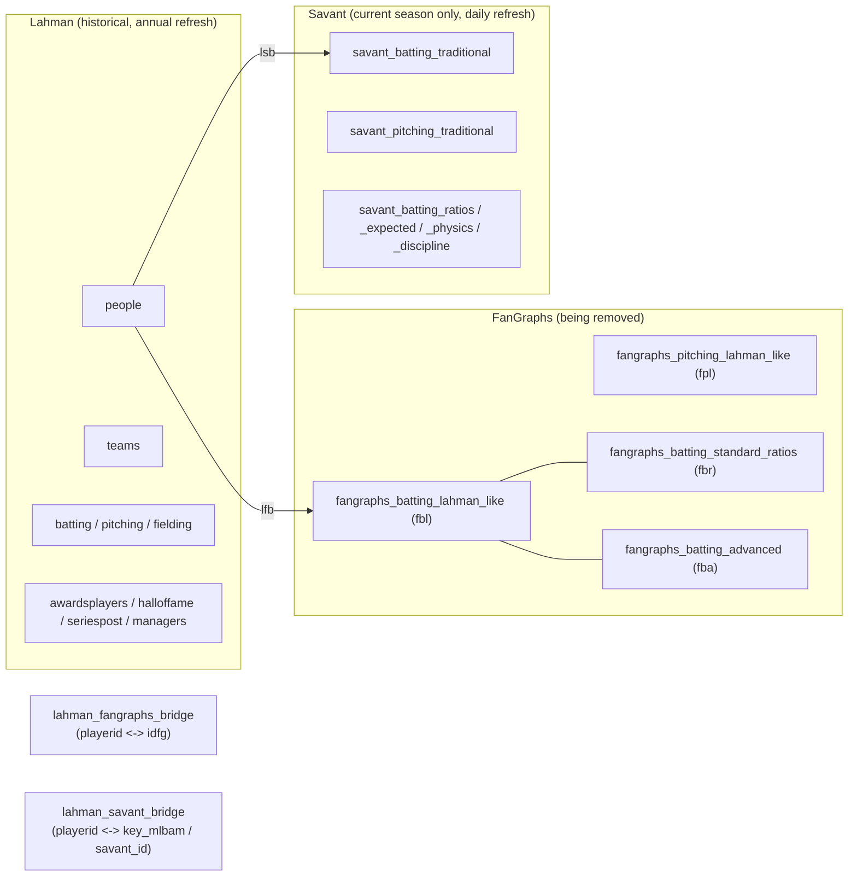

# Development Guide

Workspace map for Databaseball: an interactive baseball stats search engine that
translates natural-language questions into PostgreSQL queries (AWS RDS) via a
template layer + Google Gemini fallback, served through Streamlit.

> Status: live app, actively being hardened (2026-07). Data-source architecture is
> mid-transition — see [Active Code Areas](#active-code-areas) for what's current
> vs. being phased out.

---

## Active Code Areas

| Path | Status | Notes |
|---|---|---|
| [streamlit/app.py](streamlit/app.py) | **Active — production entrypoint** | The deployed app ([databaseball.streamlit.app](https://databaseball.streamlit.app/)). Routes a question through fast-path → template → LLM, in that order. |
| [streamlit/pages/](streamlit/pages) | Active | `test_mode.py` is a hidden NL→SQL batch test harness, gated behind `DBBALL_ENABLE_TEST_UI`. Other pages are static (About/Contact/How-to-use). |
| [nlp/generate_sql.py](nlp/generate_sql.py) | **Active — core translation logic** | Builds the LLM prompt, calls Gemini, validates the response. Also has a CLI (`python -m nlp.generate_sql "question"`). |
| [nlp/template_router.py](nlp/template_router.py) | **Active — live routing path** | Hand-coded regex → SQL builders (team ERA, division batting, player career) plus one YAML-backed template pattern. This is what `generate_sql.get_sql_and_params` and `app.py` actually call. |
| [nlp/router_fastpath.py](nlp/router_fastpath.py) | Active, narrow by design | Deterministic leaderboard shortcut for counting stats only (hr/rbi/sb/so/bb/h). Domain (batting vs. pitching) resolved from question wording. Anything else — rate stats, WAR/wOBA/etc. — falls through to templates/LLM on purpose. |
| [nlp/stats_catalog.py](nlp/stats_catalog.py) | Active | Builds `router_fastpath`'s stat catalog from `template_router.py`'s `STAT_MAP_BATTING`/`STAT_MAP_PITCHING` (static, curated — not live DB introspection). Savant-native; Lahman is the fallback source, referenced via each entry's `lahman_col`. |
| [nlp/templates/sql_templates.yml](nlp/templates/sql_templates.yml) | Active, mixed freshness | `leaders_batting_counting`/`leaders_pitching_counting`/`leaders_batting_qualified` are live, Savant-first/Lahman-fallback (dynamic boundary, no hardcoded cutover year). `leaders_batting_rate`/`leaders_pitching_rate_low_is_best` are FanGraphs-free but not reachable from any live path (see `AGENTS.md § Frozen/Legacy Zones`). `team_era_season`, `team_batting_avg_division`, `player_pitching_career_by_season` are shadowed by hardcoded duplicates in `template_router.py` and are dead code (only reachable via the CLI's data-driven matcher in `generate_sql.py`). |
| [nlp/prompts/base_prompt_gemini.txt](nlp/prompts/base_prompt_gemini.txt) | **Active — the LLM system prompt** | Governs Gemini's fallback SQL generation when no template/fast-path matches. Documents the three-tier Savant/Lahman/frozen-FanGraphs model (see below). `base_prompt_openai.txt` exists but nothing currently loads it — OpenAI is not wired in. |
| [nlp/schema/schema_description.txt](nlp/schema/schema_description.txt) | Active | Table/column reference injected into the LLM prompt. Must stay in sync with the live DB — see [Database Schema Map](#database-schema-map). |
| [nlp/linter.py](nlp/linter.py) | Active, diagnostic only | Real validation rules (PA/IP qualifier checks, TOT-mixing checks, current-year Lahman blocking, unavailable-data refusal detection). Wired into `test_mode.py` and `tests/run_regression.py`; **not** called from the live `app.py` path today. |
| [nlp/sql_render.py](nlp/sql_render.py) | Active | Lightweight lint used on the live path (`lint_sql`): fixes non-ASCII operators, catches unrendered `{{ }}` template markers. Much weaker than `linter.py` on purpose — it's meant to never reject valid SQL. |
| [etl/](etl) | **Active — scheduled + manual ETL** | `update_savant_awsrds.py` runs daily via [.github/workflows/savant_autoload.yml](.github/workflows/savant_autoload.yml) (in-season only) and loads the current season into `savant_*` tables. `load_lahman.py` was rewritten 2026-07-04 (the old version built each row's `INSERT` SQL but never called `cur.execute()` — reported "N inserted" while writing nothing, on top of using a different DB entirely via `PGHOST`/etc.). The new version connects to AWS RDS (`.env.awsrds`, matching everything else), is idempotent (only inserts rows for a year not already in the DB — a re-run is a no-op), defaults to `--dry-run`, and handles `people` separately (new `playerid`s only, no year column). Run it after refreshing `data/lahman_raw/*.csv` from a new Lahman release. |
| [scripts/](scripts) | Active, manual/one-off, handle with care | `recreate_lahman_tables.py`, `scrape_2026_rosters.py` run by hand as needed. `load_all_aws.py` is a **destructive one-time loader** — `DROP TABLE ... CASCADE` + rebuild-from-CSV for every Lahman *and* FanGraphs table, with column types inferred from the first 10 CSV rows. Do not run it for an incremental update (e.g. "just add 2025"); it wipes everything, including tables the FanGraphs-removal migration intentionally stopped touching. |
| [tests/](tests) | **Active — regression harness** | `run_regression.py` drives `test_questions.csv` through the real routing path (fast-path → template → LLM), lints with `nlp/linter.py`, executes read-only against AWS RDS, and writes timestamped CSVs to `tests/results/`. This is the primary way to check "which questions are failing" after a prompt/template change. |
| [api/](api) | **Legacy / not deployed** | A FastAPI wrapper (`main.py`, `query_router.py`) around `db/query_runner.py`. Not referenced by the live Streamlit app; `db/query_runner.py` even says "Currently not in Use" in its own header comment. Uses a different env-var naming convention (`PGHOST` etc.) than the rest of the app (`AWSHOST` etc.) — a sign it predates the current DB setup. |
| [scratch/](scratch), [notebooks/](notebooks) | Scratch space | Ad hoc scripts and exploration, not part of the running app. |
| [data/](data) | Local artifacts, gitignored | Raw Lahman CSVs, one-off FanGraphs/Statcast exports, and `processed/stats.db` (a local SQLite snapshot, separate from the AWS RDS Postgres instance the live app actually queries). |

### Architecture: three-tier data model (FanGraphs narrowed, 2026-07-03)

FanGraphs ETL access has been lost — no new FanGraphs data is obtainable going
forward. The routing model reflects this:

1. **Savant** (`savant_*`) — current, in-progress season only, daily refresh.
   `savant_batting_traditional`/`savant_pitching_traditional` in AWS RDS
   currently hold only 2026 — historical Savant/Statcast backfill has not been
   done. Statcast only exists from 2015 onward league-wide, so full historical
   parity with Lahman is never possible pre-2015 even if backfilled.
2. **Lahman** (`people`/`batting`/`pitching`/`teams`/etc.) — every other
   season, for counting stats and computed basic rates (AVG/OBP/SLG/ERA). Also
   the sole source for awards, HOF, postseason, managers, and standings, at any
   season. AWS RDS was refreshed through 2025 on 2026-07-04 via
   `etl/load_lahman.py --commit` (see § Run Commands) — all season-keyed
   tables now top out at `yearid = 2025` (`homegames` uses `yearkey`).
3. **FanGraphs** (`fangraphs_batting_advanced` / `fangraphs_pitching_advanced`
   only, aliases `fba`/`fpa`) — a FROZEN historical archive, the sole source
   for WAR/wOBA/wRC+/FIP/xFIP. No new data will ever load here, regardless of
   what `MAX(season)` shows (a stale partial current-season row may exist and
   does not mean the data is live). All other FanGraphs tables (`fbl`, `fpl`,
   `fbr`, `fpr`, `fpd`, `fbb`, `fbf`, `fpp`, `fpb`) are legacy — still present
   in the DB, still documented in the schema file for reference, but not used
   by the prompt, templates, or routers anymore.

`lahman_fangraphs_bridge` (`playerid` ↔ `idfg`, for Rule 4 only) and
`lahman_savant_bridge` (`playerid` ↔ `key_mlbam`, for Rule 1) both exist. The
FanGraphs bridge is known to be incomplete (no entry for Clayton Kershaw,
missing the current Bobby Witt Jr.) — WAR/wOBA/etc. LEFT JOINs will correctly
come back NULL for affected players rather than erroring.

---

## Local Setup

**Python version:** the project's own `.venv/` was built with Python 3.8, which
is now too old for `requirements.txt` (numpy 2.x, altair 5.5, etc. need 3.9+).
Use **Python 3.12** for new environments.

```bash
py -3.12 -m venv .venv
.venv/Scripts/pip install -r requirements.txt   # app + Streamlit
.venv/Scripts/pip install -r requirements_etl.txt  # only needed for etl/ scripts
```

**Environment files** (all gitignored — copy/create locally, never commit):

| File | Purpose |
|---|---|
| `.env.awsrds` | `AWSHOST`, `AWSPORT`, `AWSDATABASE`, `AWSUSER`, `AWSPASSWORD` — the Postgres connection the live app and ETL scripts use. |
| `.env.gemini` | `GEMINI_API_KEY` — Google Gemini API key for NL→SQL. |
| `.env.openai` | Present but unused — no code currently loads OpenAI. |
| `.streamlit/secrets.toml` (optional, local only) | Set `DBBALL_DEBUG_UI = "1"` to see routing source (fast-path/template/LLM) and raw SQL in the UI; `DBBALL_ENABLE_TEST_UI = "1"` to unlock the hidden Test Mode page. Both default off. |

**Note:** `db/query_runner.py` (used only by the legacy `api/` package) expects
`PGHOST`/`PGUSER`/`PGPASSWORD`/`PGDATABASE`/`PGPORT` instead — a different
naming convention from everything else. Don't assume it reads `.env.awsrds`
the same way the Streamlit app does.

---

## Run Commands

```bash
# Local app (from project root)
.venv/Scripts/streamlit run streamlit/app.py

# NL→SQL CLI (no Streamlit, useful for quick prompt iteration)
.venv/Scripts/python -m nlp.generate_sql "Who led the league in home runs in 2025?"
.venv/Scripts/python -m nlp.generate_sql "..." --print-prompt   # also dumps the full LLM prompt
.venv/Scripts/python -m nlp.generate_sql "..." --no-templates   # force LLM fallback, skip templates

# Regression test batch (fast-path/template/LLM + lint + live DB execution)
.venv/Scripts/python tests/run_regression.py
# results land in tests/results/regression_<timestamp>.csv

# Manual ETL (not the scheduled daily job)
.venv/Scripts/python etl/load_lahman.py               # dry run -- reports only, writes nothing
.venv/Scripts/python etl/load_lahman.py --commit       # actually loads new-season rows into AWS RDS
.venv/Scripts/python etl/load_lahman.py --only teams,batting --commit  # scope to specific tables
# scripts/load_all_aws.py is a DESTRUCTIVE one-time loader (DROP + rebuild everything,
# including legacy FanGraphs tables) -- do not use it for an incremental update; use
# etl/load_lahman.py instead.
```

The scheduled daily ETL ([.github/workflows/savant_autoload.yml](.github/workflows/savant_autoload.yml))
runs `etl/update_savant_awsrds.py` via GitHub Actions, in-season only (roughly
March 20 – November 5). It temporarily opens the RDS security group to
`0.0.0.0/0` for the run and closes it afterward — this has been a source of
intermittent connectivity failures (SG propagation timing); see the workflow's
own diagnostic steps if a run fails.

---

## Generated Files & Build Outputs

Never hand-edit:
- `tests/results/*.csv` — regenerated by `tests/run_regression.py` each run.
- `data/processed/stats.db` — local SQLite snapshot built by scratch/ETL scripts.
- `**/__pycache__/`, `*.pyc` — Python bytecode cache.
- `.venv/`, `.venv_test/` — virtual environments; rebuild from `requirements.txt` rather than editing installed packages.

## Model & Data Artifacts

- No trained ML models are involved — "the model" in this codebase always means
  the Gemini LLM called over the network, not a local artifact.
- `data/lahman_raw/*.csv` — source-of-truth Lahman CSVs for local ETL scripts.
  Overwrite only when intentionally refreshing from a new Lahman release.
- `data/processed/stats.db` — local SQLite convenience snapshot. The **live app
  queries AWS RDS Postgres, not this file** — don't assume changes here are
  visible to the deployed app.

---

## Database Schema Map

Full column-level detail lives in [nlp/schema/schema_description.txt](nlp/schema/schema_description.txt)
(this is also what gets fed to the LLM — keep it in sync with the live DB schema
whenever a table is altered). High-level shape:



Known schema quirks (verified live, 2026-07-03):
- `savant_batting_traditional` / `savant_pitching_traditional` store the player
  name in `playername` formatted **"Last, First"** (e.g. `"McLain, Matt"`), not
  "First Last" — don't string-match a "First Last" name against it directly.
  `name` is unpopulated on these tables; `player_name` duplicates `playername`.
- `playername`/`player_name` were added broadly across tables at some point but
  **not** to the core Lahman tables (`people`, `batting`, `pitching`) — those
  still only have `namefirst`/`namelast` (people) or require a join to `people`.
- Savant tables have no `'TOT'` row for traded players — each player has exactly
  one row per season there. Lahman also has no `'TOT'` row (unlike FanGraphs
  `fba`/`fpa`, which do) — a trade is just multiple `stint` rows, `SUM` them.
- `savant_batting_traditional`/`savant_pitching_traditional` currently contain
  only the current season's rows (see [Architecture: three-tier data model](#architecture-three-tier-data-model-fangraphs-narrowed-2026-07-03) above).
- Savant player IDs (`player_id`) are integers (MLBAM IDs); Lahman player IDs
  (`playerid`) are text (e.g. `'wittbo02'`). Cast one to match the other before
  combining rows from both sources into a single identifier column.
- Lahman `batting`'s doubles/triples columns are literally named `"2b"`/`"3b"`
  (quoted, since they start with a digit) — not `doubles`/`triples` as the
  schema doc's prose might suggest. Verify against `information_schema.columns`
  when in doubt.
- None of the Lahman tables (`people`, `batting`, `teams`, etc.) have a primary
  key or unique constraint in this AWS RDS instance — `ON CONFLICT` upserts
  won't work against them as-is. `etl/load_lahman.py` sidesteps this by only
  ever inserting rows for a year (or `playerid`, for `people`) not already
  present, rather than trying to upsert.
- Local Lahman CSVs (`data/lahman_raw/`) have inconsistent encodings — `Teams.csv`
  and `People.csv` have a BOM before their first header field (`Batting.csv`
  doesn't); `People.csv` also has a leading `id` column that doesn't correspond
  to any real DB column. `etl/load_lahman.py` opens with `utf-8-sig` (strips a
  BOM if present, no-op if absent) and drops any CSV column not present in the
  target table's actual schema, rather than assuming every CSV column maps to one.
- A People.csv refresh can add thousands of "new" rows that aren't really new
  players — MLB recognized Negro Leagues records as major-league stats in
  Dec 2020, and Baseball-Reference/Lahman have been incorporating newly
  researched historical players into `People.csv` in subsequent releases ever
  since. Confirmed 2026-07-04: of 3,014 new `people` rows from one refresh,
  only 243 had a 2023+ debut date (genuine new players); the other 2,771 had no
  debut date recorded and birth years from the 1890s-1920s. Don't assume a
  large `people` diff means something went wrong.

---

## AI Onboarding Notes

Read in this order before making changes:
1. [README.md](README.md) — project goals/roadmap.
2. This file.
3. [nlp/prompts/base_prompt_gemini.txt](nlp/prompts/base_prompt_gemini.txt) +
   [nlp/schema/schema_description.txt](nlp/schema/schema_description.txt) — the
   two files that jointly define what the LLM is allowed/told to do. They must
   stay logically consistent with each other and with the live DB schema; a
   contradiction between them is a recurring source of query failures.
4. [nlp/template_router.py](nlp/template_router.py) and
   [nlp/templates/sql_templates.yml](nlp/templates/sql_templates.yml) — note
   these are two *separate* routing systems (see the table above); don't assume
   editing one YAML file changes what the live app does.

Safety/process notes:
- The app executes LLM-generated SQL against a real Postgres database. `nlp/sql_render.py:lint_sql` only guards against unrendered template markers and non-ASCII operators — it will not catch a logically wrong query. Use `nlp/linter.py:lint_sql` (question-aware) plus `tests/run_regression.py` to actually validate a prompt/template change before considering it done.
- Never hardcode a specific year as a data-source cutover point (e.g. "use Savant for 2025+") — Savant only ever holds the current season, so any fixed year goes stale every season. Use the `NOT EXISTS` pattern already in `sql_templates.yml`'s `leaders_batting_counting` template as the reference implementation.
- `google-generativeai` (pinned in `requirements.txt`) is now a fully deprecated package per Google's own runtime warning — new code should migrate to `google-genai` rather than deepen the dependency on the old SDK.
